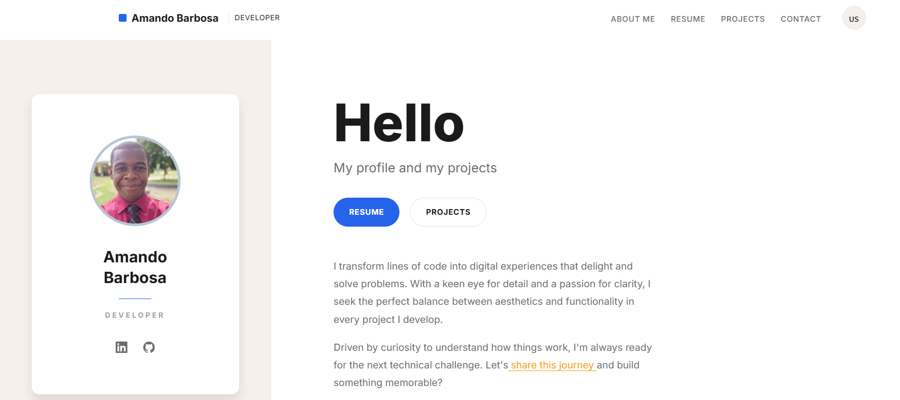

# Portfolio - Amando Barbosa



High-performance portfolio website built with modern React patterns, focusing on specialized architectural decisions for scalability, accessibility, and professional excellence.

## Tech Stack

- **Framework**: Next.js 16 (App Router) - Leveraging React Server Components for optimal initial load and SEO.
- **Language**: TypeScript 5 - Strict type safety for maintainable and refactor-resilient code.
- **Styling**: Tailwind CSS 4 - Utility-first method for consistent design tokens and low-runtime overhead.
- **Icons**: Lucide React - Minimalist and professional iconography system.
- **Animations**: Framer Motion 12 - Declarative, hardware-accelerated animations with `useInView` optimization.
- **State Management**: React Context (Language) + Local State - Simplified state architecture suitable for this scope.
- **Forms**: Web3Forms + Sonner - Serverless form handling with optimistic UI feedback.
- **Testes**: Vitest + React Testing Library - Modern automated testing suite for UI and logic.

## Architectural Decisions

### Component Design
Feature-based directory structure (`src/components/*`) ensures code co-location. Each component isolates its own:
- Logic / Hooks
- Styles (via Tailwind utility classes)
- Animation variants

### Internationalization (i18n)
Custom lightweight i18n implementation optimized for SPA (Single Page Application) behavior:
- **Strategy**: Content dictionary pattern with type-safe keys.
- **Decision vs URL-based**: Chosen State-based i18n (`localStorage` + Context) over URL-based routing (`/pt`, `/en`) to provide instantaneous language switching without route re-hydration, prioritizing user experience for a single-page scope while maintaining a clean URL structure.
- **Implementation**: `useTranslation` hook providing strictly typed access to `locales/pt.ts` and `locales/en.ts`.

### Performance & Modern Patterns
- **Full Stack Standard**: Replaced all hardcoded SVGs with `lucide-react` for icon consistency and better tree-shaking.
- **Core Web Vitals**: Images optimized with Next.js `Image` component (WebP, automatic sizing, lazy loading).
- **Bundle Optimization**: Framer Motion imports are scoped to minimize main thread execution.
- **Styling Architecture**: Zero-runtime CSS via Tailwind CSS 4, utilizing modern CSS variables for a dynamic design system.


## Project Structure

```
src/
├── app/                 # Next.js App Router (Server Components by default)
├── components/          # Reusable UI components
├── config/              # Constant configuration (social links, metadata)
├── contexts/            # React Context providers (Language)
├── hooks/               # Custom hooks (useTranslation)
├── lib/                 # Utilities and animation variants
└── locales/             # Text content dictionaries (PT/EN)
```

## Getting Started

1. **Install dependencies**
   ```bash
   npm install
   ```

2. **Run development server**
   ```bash
   npm run dev
   ```
   Access at `http://localhost:3000`.

### Scripts Disponíveis

- `npm run dev`: Inicia o servidor de desenvolvimento.
- `npm run build`: Cria a versão de produção.
- `npm run lint`: Executa a análise estática do código.
- `npm run test`: Executa a suíte de testes automatizados com Vitest.

## Testes Automatizados

O projeto conta com uma infraestrutura de testes configurada com **Vitest** e **React Testing Library**, focada em garantir a estabilidade das funcionalidades principais:

1. **Troca de Idioma**: Integração entre o Contexto e as traduções.
2. **Formulário de Contato**: Validação de campos e acessibilidade.
3. **Hero**: Renderização correta dos dados principais e CTAs.

Para rodar os testes:
```bash
npm run test
```

## License

MIT
